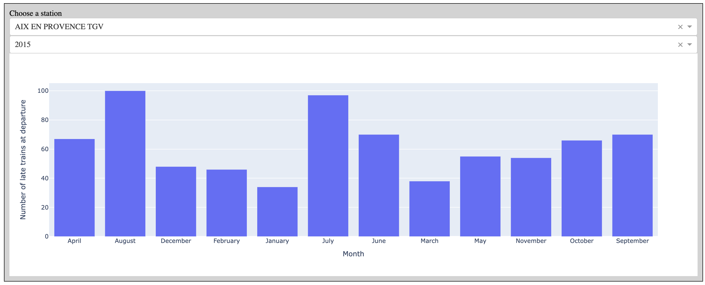

# dataviz-2023

An example of data visualization with plotly and dash in python based on class Dataviz in EPITA 2023.

The outputs consists 10 different types of charts, static and interactive, histgram, pie chart *etc*.

1. The first chart is showing the top ten and last ten stations with the highest number of delay train on the departure station side.

2. The second one is an **interactive** hierachical box chart of number of delayed trains of each station to the respect of the time.

3. The third one is a histgram with dropdown box that user can select the station and the year to find out the distribution of number of late train to the respect of months.

4. The forth one is a pie chart to illustrate the portion of late trains that were caused by *external reason* (as named from the SNCF dataset) of year 2020 from Paris Montparnasse station to Nantes station.

5. The fifth one is a line chart that depicts the normalized distrabution of late train on the arrival train station of year 2020.

6. The sixth one is a sankey diagram that tells the number of late trains between Paris train stations.

7. The seventh one is a scatter chart that tells the number of cancelled trains.

8. The eighth one is another scatter chart that illustrates the number of circulation at each station with the area size of dots represents the number of total delay time of year 2020. The negative number on the y-axis is due to the size of big dots while not saying that there are negative circulation.

9. This is an area chart that shows the circulation number of Paris stations of each year from 2015 to 2020.

10. The last one is an interactive 3-D scatter illustrating the average delay time of each station (chose from a dropdown box) of each month of each year.
